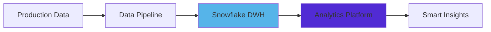

<div align="center">

# 👋 Hi, I'm Krzysztof Woźniczak

### Fullstack Developer | Smart Manufacturing Specialist | Data Engineering Enthusiast

[](https://linkedin.com/in/krzysztof-wozniczak)
[](https://www.google.com/maps/place/Ghent)

</div>

---

## 🚀 About Me

I'm a passionate **Fullstack Developer** at **GC Factory**, where I architect and develop cutting-edge solutions for **production data management** and **smart manufacturing**. With a strong foundation in **.NET ecosystem** and modern cloud technologies, I bridge the gap between industrial operations and intelligent data systems.

```csharp
var developer = new Developer
{
    Name = "Krzysztof Woźniczak",
    Role = "Fullstack Developer",
    Company = "GC Factory",
    Location = "Ghent, Belgium 🇧🇪",
    Focus = new[] { "Smart Manufacturing", "Production Data", "Industrial IoT" },
    Passion = "Building scalable solutions that transform raw data into actionable insights"
};
```

---

## 💼 Professional Focus

### 🏭 Smart Manufacturing Solutions
- Developing real-time production monitoring systems
- Building data pipelines for manufacturing analytics
- Implementing Industry 4.0 solutions

### 📊 Data Engineering
- Designing and optimizing data warehouses in **Snowflake**
- Creating ETL processes for production data
- Building BI solutions for operational intelligence

### 🔧 Enterprise Application Development
- Architecting scalable **.NET** applications
- Developing robust **WPF** desktop solutions
- Implementing microservices architectures

---

## 🛠️ Technology Stack

### Languages & Frameworks


### Data & Databases


### Cloud & DevOps


### Tools & Practices


---

## 📈 What I'm Working On



- 🔄 Building real-time data synchronization systems
- 📊 Developing production analytics dashboards
- 🤖 Implementing automated quality control solutions
- ☁️ Migrating legacy systems to cloud-native architectures

---

## 🎯 Core Competencies

<table>
<tr>
<td valign="top" width="50%">

### Backend Development
- Enterprise-grade .NET applications
- RESTful API design & implementation
- Microservices architecture
- Database optimization & design
- Asynchronous programming

</td>
<td valign="top" width="50%">

### Data Engineering
- ETL/ELT pipeline development
- Data warehouse architecture
- Real-time data processing
- Business intelligence solutions
- Data modeling & optimization

</td>
</tr>
<tr>
<td valign="top" width="50%">

### Frontend Development
- WPF desktop applications
- Modern JavaScript frameworks
- Responsive UI/UX design
- MVVM pattern implementation
- Real-time dashboards

</td>
<td valign="top" width="50%">

### DevOps & Cloud
- Azure cloud services
- Docker containerization
- CI/CD pipeline setup
- Infrastructure as Code
- Monitoring & logging

</td>
</tr>
</table>

---

## 🌱 Currently Exploring

- 🧠 Machine Learning for predictive maintenance
- ⚡ Real-time streaming with Apache Kafka
- 🎨 Modern frontend frameworks (React/Vue)
- 🔐 Advanced security patterns in distributed systems
- 🌐 Industrial IoT protocols (OPC UA, MQTT)

---

## 💡 Philosophy

> "The best code is not just functional—it's maintainable, scalable, and tells a story that future developers can understand and build upon."

I believe in:
- ✅ **Clean Code** - Writing code that humans can understand
- ✅ **Test-Driven Development** - Building confidence through comprehensive testing
- ✅ **Continuous Learning** - Staying curious and embracing new technologies
- ✅ **Collaboration** - Sharing knowledge and growing together as a team
- ✅ **Pragmatic Solutions** - Balancing perfection with practical delivery

---

## 📫 Let's Connect!

I'm always interested in discussing:
- 💼 Collaboration opportunities
- 🏭 Smart manufacturing challenges
- 💻 Software architecture patterns
- 📊 Data engineering best practices
- 🚀 Innovative technology solutions

[](https://linkedin.com/in/krzysztof-wozniczak)

---

<div align="center">

### ⭐ "Transforming production data into production excellence" ⭐


</div>
